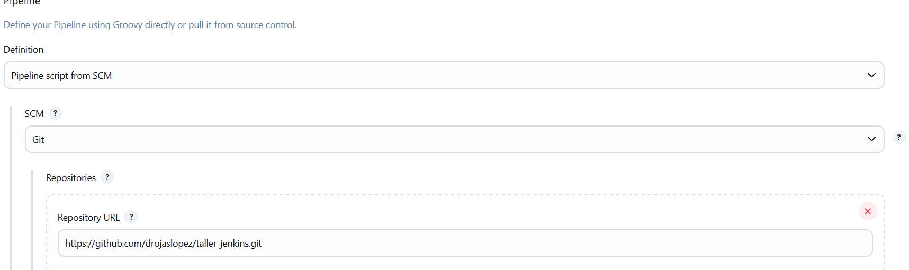
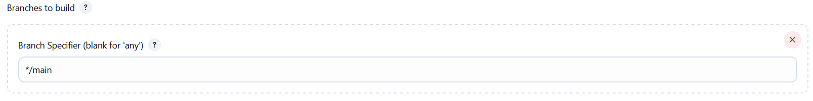
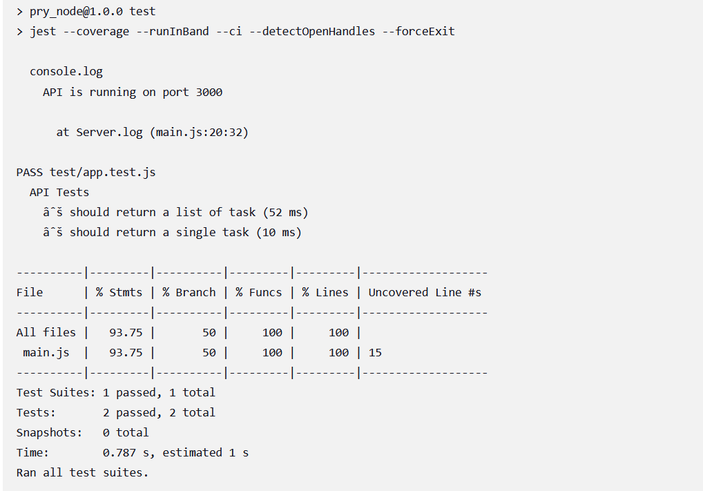
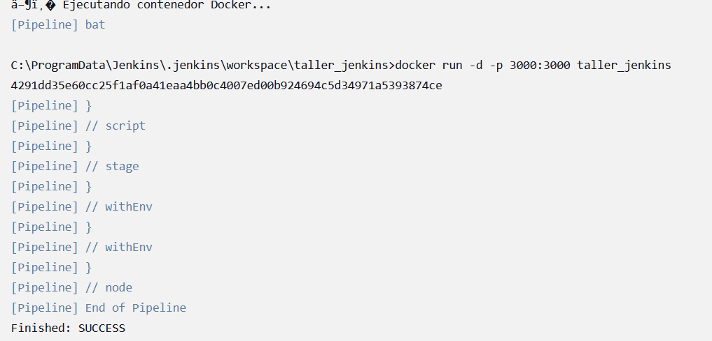
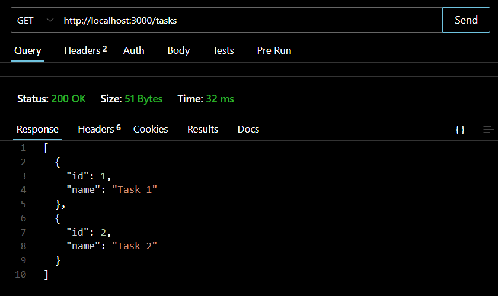
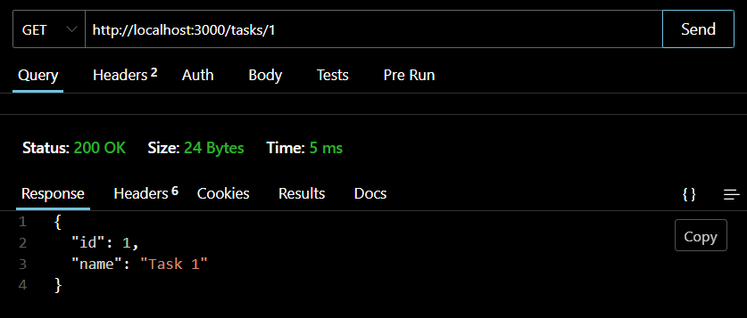

# Taller CI
### Daniel Rojas
## Iniciacion del proyecto

Creación de la API con Node.js, Express, Jest y Supertest

Se instalaron los siguiente paquete para poder realizar las pruebas
``` bash
# Inicializar el proyecto Node.js
npm init -y
``` 

``` bash
# Instalacion de paquetes
npm i express jest supertest
```

``` bash
# Para poder ejecutar el codigo en modo desarrollo
npm run start
```

``` bash
# Para ejecucion de prueba
npm run test
```


## Subida del proyecto al repositorio

``` bash
# Agregar el repositorio remoto
git remote add origin https://github.com/drojaslopez/taller_jenkins

# Verificar los compomente modificados o que se agregaran
git status

# Se añaden los elemento para subir al repositorio
git add .

# Se crea el commit para identificar la subida al repositorio
git commit -m "Subida incial"

# Se verifica que se cargaran todos los archivos y el comentario del commit
git status

# Subir los cambios al repositorio remoto
git push -u origin main
```

## Ejecucion del Pipeline-

El pipeline se configura estableciendo los parámetros que se detallan a continuación:

 
   
 
  

Una vez configurado el pipeline, se procede a su ejecución. Este iniciará el despliegue de todas las etapas, las cuales serán detalladas en la consola del pipeline.





## Ejecucion de los end point del contenedor

Se utiliza ThunderClient para probar los servicios creados



